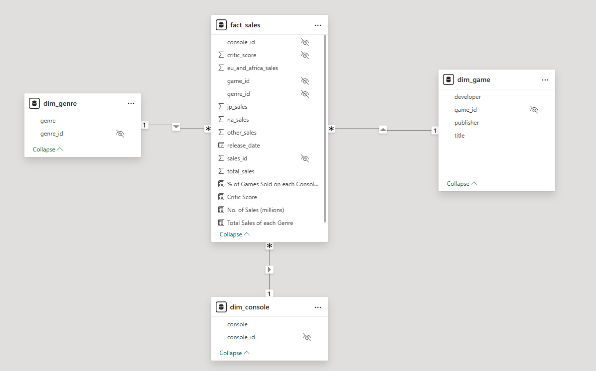
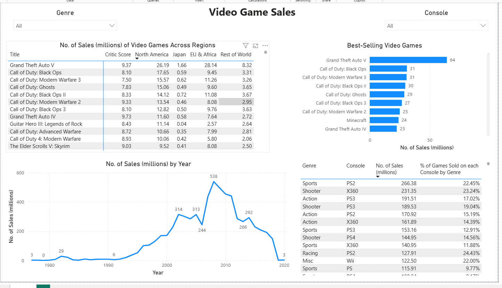

# Video Game Sales

## Objective
This project analyse global video game sales datas for 64,016 titles released between 1971 and 2024 across North America, Japan, the EU, Africa, and the rest of the world. The analysis aims is to uncover trends in worldwide and regional sales, identify top-selling titles and peak sales years to evaluate industry groweth,and explore dominant genre across gaming consoles. 

### Project Scope
This project aims to answer these questions.
- Which titles achieved the highest worldwide sales?
- Which years recorded peak sales, and how has the industry grown or fluctuated over time?
- Do certain consoles specialised in specific genres?
- which titles succeed in one region but underperform in others?

### Dataset overview 
The raw dataset used in this analysis is available from [Maven Analytics](https://mavenanalytics.io/data-playground/video-game-sales). It contains 64,016 records and fields consisting of:
|Column Name | Description              |
|------------|--------------------------|
| img | URL to link the image
| title | Game title |
| console | Console the game was released for |
| genre | Genre of the game|
| developer | Developer of the game | 
| critic score | MetaCritic score (out of 10) |
| total_sales | Global sales of copies in millions |
| na_sales | North American sales of copies in millions |
| jp_sales | Japanese sales of copies in millions |
| pal_sales | European & African sales of copies in millions |
| other_sales | Rest of world sales of copies in millions |
| release_date | Date the game was released on |
| last_update | Date the data was last update |

I have utilised Power BI to clean and transforming dataset, after cleaning the dataset there were only 17,505 records that were deemed useable for the analyses. Additional to optimised the dataset for analytical purposes I have applied Kimball Star Schema referred to Figure 1 to see how the data is organised. 

#### Figure 1: Model View

### Access to resources
- Power BI dashboard click [here](assets/game_sales.pbix).
- Raw global video games sales dataset is available [here](https://mavenanalytics.io/data-playground/video-game-sales).

#### Figure 2: Video Game Sales

## Findings & Implications 
### Best-Selling Titles
- GTA V leads with 64M units, far ahead of the next best (COD: Black Ops at 31M).
- Call of Duty dominates the top 10, with 7 entries.
- The dominance of GTA and Call of Duty shows that established franchises generate predictable, high-volume sales by rely heavily on sequels and knownn IPs. The investment in new IP is risker, so studios prioritise on expansion over innovation. 

### Sales Over Time
- Sharp rise from 1990 (6M) to 2010 (538M), peaking in 2010.
- Steep decline post-2010, dropping to just 3M by 2020. This aligns with the rise of mobile gaming, free to play games with in game purchases, digital downloads and subscription models like Game Pass and PS Plus.

### Genre & Console Breakdown
- Sports and Shooter genres dominate, especially on PS2, X360, and PS3.
- PS2 leads in Sports (266.38M, 22.45%), while X360 leads in Shooter (231.35M, 23.24%).
- Wii excels in Misc genre, likely due to family-friendly titles.
- Game developers should choose console platforms based on genre of the game. Console manufactures can use genre strengths to shape exclusives and partnerships with game developer to develop better consoles.

### Regional Sales Patterns
- North America dominates sales for most titles, especially Call of Duty and GTA franchises.
- Japan consistently shows low sales, even for global hits like GTA V (only 1.66M).
- EU & Africa rival North America in sales for top titles like GTA V (28.14M vs. 26.19M).
- Rest of World contributes moderately, with GTA V again leading (8.32M).
- North American, Europe and Africa contibute the majority of sales while Japan consistently shows low sales for Western titles. Therefore werstern publishers may deprioritse marketing efforts toward Japan unless the genre aligns with Japanese preference of RPG, Nintendo titles.

## Conlusion 
This analysis highlights global video game sales trends over past 50 years. Established series like Grand Theft Auto and Call of Duty dominate worldwide sales, reflecting the industry’s reliance on proven IP. Sales peaked around 2010, then declined sharply as mobile gaming, digital distribution, and subscription models reshaped consumer behaviour. Genre performance varies strongly by console, with Sports thriving on PlayStation, Shooters on Xbox, and family‑friendly titles on the Wii. Regionally, North America and Europe/Africa drive most sales, while Japan shows consistently lower demand for Western titles, reinforcing the need for region‑specific marketing and genre alignment
